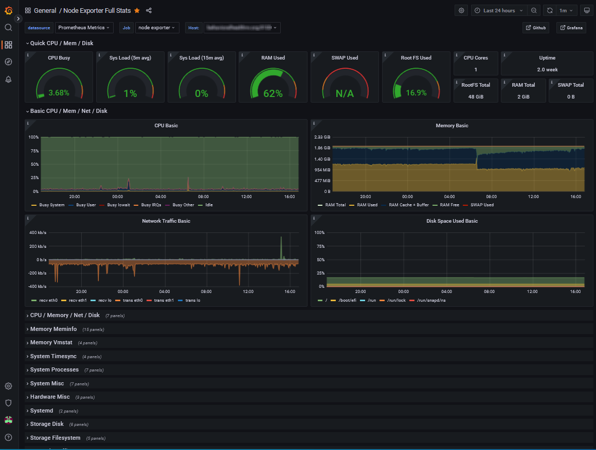

---

[Prometheus](https://prometheus.io/) is an open-source application created for systems monitoring and alerting. The Prometheus server application can produce limited visualizations of data that it collects and stores from Exporters which send it the data. Prometheus and it's Exporters are good for measuring numerical values over time, things such as: Data Storage/Memory Usage, Network Stats, and Process Monitoring.

{{ with .Resources.GetMatch "grafana_ex_anon.png" }}
  
{{ end }

Prometheus is often paired with the open-source visualization software [Grafana](https://grafana.com) which improves the end-user experience by making queries easier and better looking. In addition to the visualization app, Grafana also makes a log aggregation system called [Loki](https://grafana.com/oss/loki/). Loki is a powerful tool for monitoring activity on remote servers and makes identifiying possible issues or threats much easier.

Through this article series I'll go through setting up a Prometheus server on a remote VPS (In this case a 'droplet' on DigitalOcean). The series will cover Installing Prometheus, Installing Grafana, Installing Node Exporter on both local and remote sources, Installing Black Box locally, Installing Loki, and Finally Installing Promtail on both local and remote sources. After following the tutorials in this series you will end up with a monitoring dashboard that looks something like the examples shown.



## Getting Started

*For the purposes of this article you will need SSH access to a VPS or local machine running Ubuntu 20.04 LTS*

There are a few different ways to handle getting Prometheus started. The easiest way to get going quickly is to use Prometheus as a Docker image, Prometheus has [instructions on it's website](https://prometheus.io/docs/prometheus/latest/installation/) for doing this if you would like to go that route. For the purposes of this article I'll go through installing Prometheus 'locally', locally in this instance refers to a DigitalOcean VPS. I'll use this setup for the rest of this series so if you do something different your experience may differ slightly.


**DigitalOcean VPS**\
For this article I am installing Prometheus on a DigitalOcean 2vCPU, 4GB Memory Droplet. Prometheus seems to have relatively low memory usage compared to other monitoring apps I tried (looking at you Elastic), you should be able to follow these directions on any comparable Cloud VPS running Ubuntu 20.04 or with a bit of 'fanagaling' the Debian equivalent.


---

## Installing Prometheus

To install Prometheus we'll first create a new user on our server to run the app, and create some necessary folders, then grant the correct permissions. From there we'll download Prometheus and move it to the correct location to run from, setup a config file, and then create a service to run the app.

### Creating a user account

We'll start with creating a user named 'prometheus'.
```
sudo useradd -rs /bin/false prometheus
```
The '-rs /bin/false' modifier defines this user as a 'system' account, and setting the shell as /bin/false prevents this user from being logged into.

Next let's make the folders Prometheus will need and assign their ownership to the prometheus user and group.
```
sudo mkdir /etc/prometheus
sudo mkdir /var/lib/prometheus
sudo chown prometheus:prometheus /etc/prometheus
sudo chown prometheus:prometheus /var/lib/prometheus
```

### Download Prometheus

*At the time of this article the most recent Prometheus version is 2.31.1, however you should check the Prometheus website [downloads section](https://prometheus.io/download/) for the most recent version.*

With the user made and the folders in place we're ready to download Prometheus. For this we'll navigate to the /tmp folder, download Prometheus, uncompress the tarball, move the files to their correct locations on the server, and then update the permissions to grant access to our 'prometheus' user and group.
```
cd /tmp

wget https://github.com/prometheus/prometheus/releases/download/v2.31.1/prometheus-2.31.1.linux-amd64.tar.gz
tar -xzvf prometheus-2.31.1.linux-amd64.tar.gz prometheus/

sudo mv prometheus/prometheus /usr/local/bin/
sudo mv prometheus/promtool /usr/local/bin/

sudo chown prometheus:prometheus /usr/local/bin/prometheus
sudo chown prometheus:prometheus /usr/local/bin/prometheus
```

### Configure Prometheus

To make Prometheus work we need to define a configuration file. This file will define some of Prometheus' general settings as well as how, which, and where the Exporters are that Prometheus should listen to.

First create the configuration file.
```
sudo vim /etc/prometheus/prometheus.yml
```

Here is a basic configuration to get us started, it will pull the basic metrics that Prometheus itself collects. Later this can be expanded on to add additional Exporters to monitor. Copy what's below into the prometheus.yml file.
```
global:
  scrape_interval:     15s
  evaluation_interval: 15s

rule_files:
  # - "first.rules"
  # - "second.rules"

scrape_configs:
  - job_name: 'prometheus'
    scrape_interval: 5s
    static_configs:
      - targets: ['localhost:9090']
```
The Prometheus configuration file has quite a few options, you can see them all in the [Prometheus configuration documentation](https://prometheus.io/docs/prometheus/latest/configuration/configuration/). We'll start with this simple configuration for now, and add on to this throughout this series.

Next we need to update the permissions of the configuration file for our 'prometheus' user and group.
```
sudo chown prometheus:prometheus /etc/prometheus/prometheus.yml
```

### Setup a service to run Prometheus

With the other pieces in place we're ready to create a service to handle running the Prometheus app. The service will tell Ubuntu which user to use when running Prometheus as well as tell Prometheus where it can find the configuration file and the data to monitor. Create the service file with the following command.
```
sudo touch /etc/systemd/system/prometheus.service
```

Fill in the prometheus.service file with what's below.
```
[Unit]
Description=Prometheus Monitoring
Wants=network-online.target
After=network-online.target

[Service]
User=prometheus
Group=prometheus
Type=simple
ExecStart=/usr/local/bin/prometheus \
--config.file /etc/prometheus/prometheus.yml \
--storage.tsdb.path /var/lib/prometheus/ \

ExecReload=/bin/kill -HUP $MAINPID

[Install]
WantedBy=multi-user.target
```

Now Prometheus should be ready to run. First we'll get the Prometheus service running.
```
sudo systemctl start prometheus.service
```

Then we should check if there are any errors with what we have done so far.
```
sudo systemctl status prometheus.service
```

If the status update returns an error code, you'll need to retrace your steps and fix the issue before continuing. If the status comes back 'active' then we should be set to 'enable' the service. Enabling the service sets it so that it will automatically restart when the server does.
```
sudo systemctl enable prometheus.service
```

We should now have an operating Prometheus app, accessible through it's default of http://localhost:9090.

### Opening the firewall

If you are using a firewall app to secure your server (You should be) you will need to open port 9090 to TCP traffic. You can do this with UFW with the following command.
```
sudo ufw allow 9090
```
---

## Installing Grafana

Like Prometheus, Grafana has a couple of different options for installation including a hosted cloud option that will avoid having to go through all of this if you wish. However, we are interested in the 'self-managed' version of Grafana, specifically we will be using the 'Enterprise Edition'.

For our purposes we will be using the option to install Grafana from the APT repository. This will allow Grafana to be updated in the future using the 'apt update/upgrade' command instead of having to download and reinstall from the web.

Lets start with installing the necessary dependencies for Grafana.
```
sudo apt-get install -y apt-transport-https
sudo apt-get install -y software-properties-common wget
```

Now we add Grafana Enterprise stable release to the apt repository.
```
wget -q -O - https://packages.grafana.com/gpg.key | sudo apt-key add -
echo "deb https://packages.grafana.com/enterprise/deb stable main" | sudo tee -a /etc/apt/sources.list.d/grafana.list
```

And then we can update the apt repository list and install Grafana.
```
sudo apt-get update
sudo apt-get install grafana-enterprise
```

### Setup a service for Grafana

Just like with Prometheus we need to create a service that will keep Grafana running.

This first command tells systemctl to check for new services.
```
sudo systemctl daemon-reload
```

Next lets start the Grafana service and then check if it's working Ok.
```
sudo systemctl start grafana-server
sudo systemctl status grafana-server
```

If the status comes back 'active' then we are good to enable the service.
```
sudo systemctl enable grafana-server
```

### Opening the Firewall

From here we should be able to now see our Grafana instance available at http://localhost:3000. If the server/website is not available you may need to open port 3000 on your Firewall to TCP traffic.
```
sudo ufw allow 3000
```

The default user should be admin/admin, you should update this as soon as you get into Grafana. For the time being this is only accessible via URL:Port, in a future article I will cover creating a reverse proxy with Apache to route traffic to Grafana via a subdomain.

---

## Installing Node Exporter

[Node Exporter](https://github.com/prometheus/node_exporter) is one of the many premade exporters available for Prometheus. Node Exporter is a hardware and OS metrics tool for Linux, that uses 'collectors' to pull metrics from it's host machine and then make them available for a scrapper to come along and pull. Node Exporter will typically be installed on a host machine that you would want to monitor, we'll be installing it on the same machine we installed Prometheus on in this example. Installing Node Exporter on a remote machine will be covered in a future article.

### Create a User

Like with Prometheus we will first create a system user account for Node Exporter to use. The user will be named 'exporter' and we'll use the same -rs /bin/exporter to create the account. From there we'll make a folder for the Node Exporter app and another for the config file, then we'll give permissions to these folders to the exporter user and group.
```
sudo useradd -rs /bin/false exporter

sudo mkdir /usr/local/bin/node_exporter
sudo mkdir /etc/prometheus/node_exporter

sudo chown -R exporter:exporter /usr/local/bin/node_exporter
sudo chown -R exporter:exporter /etc/prometheus/node_exporter
sudo chmod -R 777 /usr/local/bin/node_exporter
sudo chmod -R 777 /etc/prometheus/node_exporter

```

### Download Node Exporter

*At the time of this article the most recent Node Exporter version is 1.2.2, however you should check the Prometheus website [downloads section](https://prometheus.io/download/#node_exporter) for the most recent version.*

Next we'll download the Node Exporter app. Navigate to the /tmp folder, download the Node Exporter, uncompress the tarball file, move the Node Exporter app to it's working directory, and the navigate back to your 'home' folder.
```
cd /tmp
curl -O -L https://github.com/prometheus/node_exporter/releases/download/v1.2.2/node_exporter-1.2.2.linux-amd64.tar.gz
tar xzvf node_exporter-*.*-amd64.tar.gz
sudo mv node_exporter-*.*-amd64 /usr/local/bin/node_exporter
cd
```

### Setup up a service to run Node Exporter

From here we'll create the Node Exporter service file.
```
sudo vim /etc/systemd/system/node_exporter.service
```

And then we'll fill that in with the text below.
```
[Unit]
Description=Node exporter for Prometheus
After=network.target

[Service]
User=exporter
Type=simple
ExecStart=/usr/local/bin/node_exporter/node_exporter

[Install]
WantedBy=multi-user.target
```

We can now start our Node Exporter service. Like with Prometheus we'll start the Node Exporter service and then check if it's running properly.
```
sudo systemctl start node_exporter.service
sudo systemctl status node_exporter.service
```

If the service returns 'active' then we can move forward with enabling it.
```
sudo systemctl enable node_exporter.service
```

### Add Node Exporter to Prometheus

Finally we'll go ahead and add a job within our Prometheus configuration file to scrape data from Node Exporter. Open the prometheus.yml and then add the following to the end.
```
- job_name: 'node_exporter'
  scrape_interval: 5s
  static_configs:
    - targets: ['localhost:9100']
```

In .yml files the spacing is important so make sure the spacing matches up properly with the 'prometheus' job that's already there. The final configuration file should read like this
```
global:
  scrape_interval:     15s
  evaluation_interval: 15s

rule_files:
  # - "first.rules"
  # - "second.rules"

scrape_configs:
  - job_name: 'prometheus'
    scrape_interval: 5s
    static_configs:
      - targets: ['localhost:9090']
  - job_name: 'node_exporter'
    scrape_interval: 5s
    static_configs:
      - targets: ['localhost:9100']
```

Now we can log back into our Grafana server at http://localhost:3000 and then add our Node Exporter as a data source.
-  From the sidebar click on the + icon
-  in 'settings' go to 'data sources'
-  select 'Add data source'
-  select 'Node Exporter'
-  set the URL to the URL of prometheus localhost:9090
-  Save & Test
-  add dashboard - 1860
